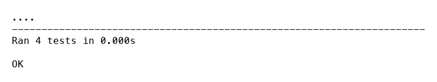

# Homework 2: Practice TDD by adding functions to Calc
#### Student：314554052 / 梁欣童

## Project Overview
- **Language / Files**: Python implementation in `Calc.py` with accompanying tests in `CalcTest.py`.
- **Goal**: Extend `Calculator` beyond addition using test-driven development (TDD) and complete optional exercises from `CalcTDD.pdf`.
- **Artifacts**:
  - Final code: `Calc.py`
  - Tests: `CalcTest.py`
  - CI workflow (optional exercise): `.github/workflows/python-ci.yml`

## TDD Cycles

### 1. Subtraction
1. **Test** — Added `test_subtract` (CalcTest.py:15) asserting `5 - 2 = 3`.  
2. **Failure** — Running `python3 -m unittest CalcTest.py` produced an `AttributeError` for missing `subtract`.  
3. **Implementation** — Added `subtract` in `Calc.py:5` returning `a - b`.  
4. **Result** — Tests rerun successfully (`..`). No refactor needed.

### 2. Multiplication
1. **Test** — Added `test_multiply` (CalcTest.py:20) expecting `4 * 3 = 12`.  
2. **Failure** — Test suite failed with `AttributeError: 'Calculator' object has no attribute 'multiply'`.  
3. **Implementation** — Added `multiply` in `Calc.py:8` returning `a * b`.  
4. **Result** — Suite green after rerun. No refactor required.

### 3. Division
1. **Test** — Added `test_divide` (CalcTest.py:25) confirming true division (`5 / 2 = 2.5`) and a `float` result.  
2. **Failure** — Test suite errored because `divide` did not exist.  
3. **Implementation** — Added `divide` in `Calc.py:11`, returning `a / b` and raising `ZeroDivisionError` on zero divisor.  
4. **Result** — Tests passed, ensuring requirement for floating-point division is encoded. No further refactor necessary.

## Final Test Suite
- Command: `python3 -m unittest CalcTest.py`
- Output:

## Optional Exercise: Continuous Integration
- Configured GitHub Actions workflow `python-ci.yml` to:
  1. Check out the repository.
  2. Install `flake8` and `coverage`.
  3. Run `flake8 .` to enforce style.
  4. Execute `coverage run -m unittest discover -s . -p '*Test.py'` and report coverage.

---

## Appendix
## **AI Interaction Report**
Representative interactions with AI assistants during the assignment.

- **Tool**: gpt-5 (2025-10-18)  
  **Purpose**: Parsed CalcTDD requirements and produced the initial TDD task list.  
  **Excerpt**: “Plan: 1) Review calculator and tests. 2) Add failing subtraction test and implement it. 3) Repeat for multiplication. 4) Add division test enforcing float output.”

- **Tool**: gpt-5-codex (2025-10-18)  
  **Purpose**: Generated and refined the GitHub Actions workflow to satisfy the optional CI exercise.  
  **Excerpt**: “Updated `.github/workflows/python-ci.yml` so the steps run from `flake8 .` succeeds, and coverage discovers `'*Test.py'` suites.”

- **Tool**: gpt-5-codex (2025-10-18)  
  **Purpose**: Drafted and iterated on this homework report in Markdown format.  
  **Excerpt**: “Created `Calc_TDD_Report.md` documenting TDD cycles, CI configuration, and deliverable checklist per CalcTDD.pdf guidance.”

These interactions supported planning, workflow automation, and documentation while all code and tests were implemented locally.